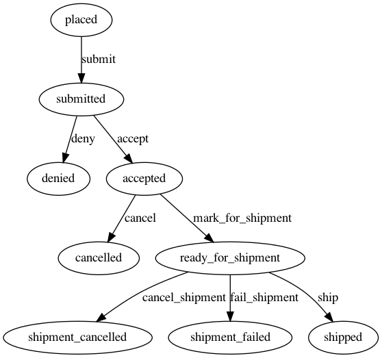
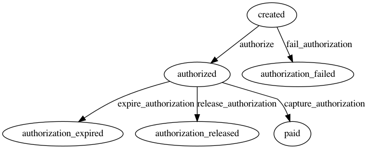

Attempt to rewrite https://github.com/aniarosner/payments-ddd in a modular way

Using `ActiveSupport::Notifications` as EventBus

## TO DO:
- replace `ActiveSupport::Notifications` with RabbitMQ, 
- use durable queues and messages
- send one event to multiple queues (one queue per subscription, https://www.rabbitmq.com/getstarted.html, lesson 4 looks the most suitable)
- use manual acknowledgement (http://rubybunny.info/articles/queues.html#message_acknowledgements)
 
This way even if something crashes in the middle of handling the event - event stays in the queue

## Sidekiq cron jobs, running each minute: 
1) marks all the payments created more than 20 min ago
and still not "authorized" as "authorization_failed"
2) marks all the "authorized" payments with "authorization_expires_at" <= NOW as "authorization_expired"

# Tables:

## Product
- name
- current_price
- available_quantity

## Order
- has_many :order_lines
- has_one :shipping_info
- has_one :contact_info
- has_one :payment
- status

State machine:

**placed** ->**submitted**
then we try to reserve the required quantity,
**if failure** - **cancelled**, we then display this to user with a "modify order" button, which is "place_order?retry_order_id=123",
e.g. he'll create a new order but FE will show him pre-filled fields from previous one
**if success** -> **accepted**, schedule a job to **cancel** the order in 30 min and try to authorize required amount
**if authorization is successful** - we ship the order and mark it as **shipped**,
**if authorization failure** - display "retry payment" and "modify order"(e.g. cancel order and redirect to "place_order?retry_order_id=123") buttons

## OrderLine
- order_id
- product_id
- quantity
- price_at_submit

## ShippingInfo
- order_id
- receiver_name
- shipping_address

# ContactInfo
- order_id
- phone
- email

## CreditCardPayment
State machine:

- order_id
- currency ??
- amount
- transaction_identifier
- status